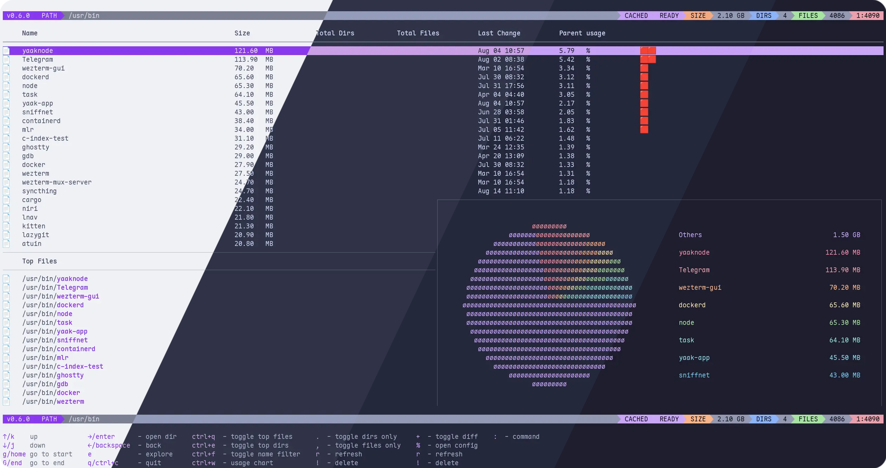

<h3 align="center">
	<br/>
	
	Catppuccin for <a href="https://github.com/crumbyte/noxdir">noxdir</a>
	
</h3>

<p align="center">
	<a href="https://github.com/catppuccin/noxdir/stargazers"></a>
	<a href="https://github.com/catppuccin/noxdir/issues"></a>
	<a href="https://github.com/catppuccin/noxdir/contributors"></a>
</p>

<p align="center">
	
</p>

## Previews

<details>
<summary>🌻 Latte</summary>

</details>
<details>
<summary>🪴 Frappé</summary>

</details>
<details>
<summary>🌺 Macchiato</summary>

</details>
<details>
<summary>🌿 Mocha</summary>

</details>

## Usage

1. Download the flavor and theme combination of your choice.
2. Edit the config file for noxdir at `$HOME/.noxdir/settings.json` (create it if it doesn't exist). Set the value for `colorSchema` to the **full absolute path** of the theme file (`~` and `$HOME` will not work):

```json
{
  "colorSchema": "/home/user/.noxdir/catppuccin-mocha-mauve.json"
}
```

## 💝 Thanks to

- [Rui](https://github.com/ruiiiijiiiiang)

&nbsp;

<p align="center">
	
</p>

<p align="center">
	Copyright &copy; 2021-present <a href="https://github.com/catppuccin" target="_blank">Catppuccin Org</a>
</p>

<p align="center">
	<a href="https://github.com/catppuccin/catppuccin/blob/main/LICENSE"></a>
</p>
